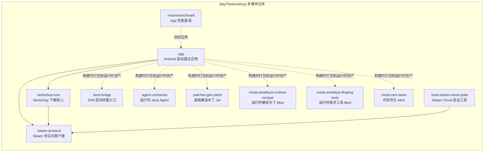
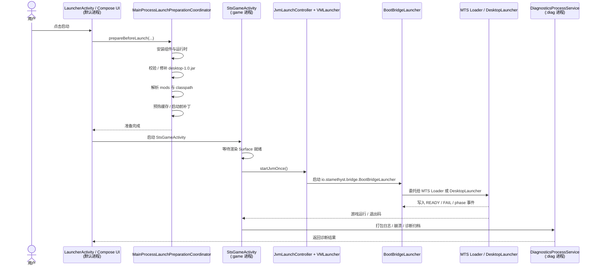
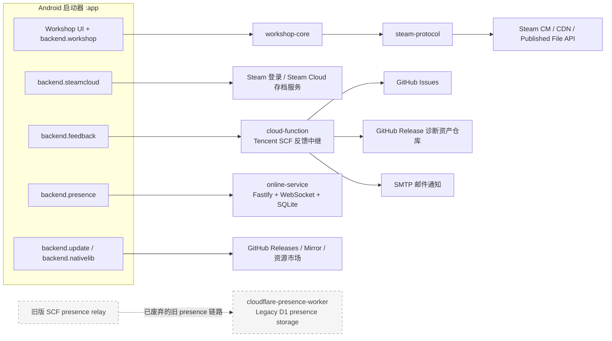

# SlayTheAmethyst 架构总览

这份文档的目标不是替代实现细节文档，而是给出一份可以跟代码一起维护、可直接渲染、可继续细化的仓库级架构图。

正式汇报版图集见：[system-architecture-report.md](./system-architecture-report.md)。

## 推荐绘图工具

首选 `Mermaid`。

原因：

- 纯文本，可直接由 Codex 生成和持续更新。
- GitHub / Markdown / Codex 都能直接渲染，不需要额外二进制源文件。
- 非常适合和当前仓库一起做版本管理、Code Review、差异比较。
- 后续如果你还要做展示版，可以再从 Mermaid 转到 draw.io / Excalidraw / Figma 做视觉润色。

如果你的目标是“先把正确架构画出来，而且后面还要持续随代码更新”，这个仓库最适合先用 Mermaid 落地。

## 1. 仓库模块架构

### 模块职责摘要

| 模块 | 主要职责 |
| --- | --- |
| `:app` | Android 启动器 UI、启动编排、资源安装、模组管理、Workshop、Steam Cloud、反馈、Presence、更新 |
| `:workshop-core` | 下载 Steam Workshop 内容所需的下载器、分块处理、校验与输出路径管理 |
| `:steam-protocol` | Steam 目录/认证/内容/Published File 的协议层客户端 |
| `:boot-bridge` | JVM 进程实际入口，负责把启动阶段状态桥接回 Android 侧 |
| `:agent-connector` | 通过 `-javaagent` 注入运行中的游戏 JVM，向外暴露调试/监控协议 |
| `:patches:gdx-patch` | 通过补丁类修正桌面 LibGDX / SteamInput / Shader 等兼容性问题 |
| `mods/*` | 以 ModTheSpire Patch 形式交付的运行时修复、触屏适配、调试能力、内存优化 |
| `:macrobenchmark` | 面向 `:app` 的 Android Macrobenchmark 性能测试 |
| `:tools:steam-cloud-spike` | 独立验证 Steam Cloud 链路，不属于 APK 运行时主路径 |

## 2. `:app` 内部分层

```mermaid
flowchart TB
    subgraph UI["UI / 交互层"]
        MainUI["ui.main / LauncherActivity / LauncherContent"]
        SettingsUI["ui.settings / ui.preferences"]
        WorkshopUI["ui.workshop"]
        FeedbackUI["ui.feedback"]
    end

    subgraph Orchestration["启动与运行编排层"]
        Launch["backend.launch"]
        Render["backend.render"]
        Runtime["backend.runtime"]
        Resources["backend.resources"]
        Process["backend.process / backend.bridge / backend.audio"]
    end

    subgraph Domain["业务子系统层"]
        Mods["backend.mods"]
        Workshop["backend.workshop"]
        SteamCloud["backend.steamcloud"]
        Feedback["backend.feedback"]
        Presence["backend.presence"]
        Update["backend.update / backend.github / backend.nativelib"]
    end

    subgraph Platform["平台与支撑层"]
        Diag["backend.diag / backend.crash"]
        Files["backend.file_interactive / backend.fs"]
        Steam["backend.steam"]
        Network["backend.network"]
    end

    subgraph RuntimeAssets["运行时资产"]
        DesktopJar["desktop-1.0.jar"]
        RuntimePack["runtime-pack / files/runtimes/Internal"]
        BootBridgeJar["boot-bridge.jar"]
        AgentJar["agent-connector.jar"]
        RuntimeMods["MTS Mods / enabled_mods.txt / mods/*.jar"]
        PatchJar["gdx-patch.jar"]
    end

    MainUI --> Launch
    SettingsUI --> Launch
    WorkshopUI --> Workshop
    FeedbackUI --> Feedback

    Launch --> Mods
    Launch --> Runtime
    Launch --> Resources
    Launch --> Render
    Launch --> Process

    Workshop --> WorkshopCoreLib["project(:workshop-core)"]
    WorkshopCoreLib --> SteamProtocolLib["project(:steam-protocol)"]

    SteamCloud --> Steam
    Feedback --> Diag
    Presence --> Network
    Update --> Network

    Launch --> DesktopJar
    Launch --> RuntimePack
    Launch --> BootBridgeJar
    Launch --> AgentJar
    Launch --> RuntimeMods
    Launch --> PatchJar
```

## 3. 启动与运行时链路

详细说明见 [backend-startup-chain.md](./backend-startup-chain.md)。下面这张图是主干路径的压缩版。

### 运行时关键产物

- `sts/desktop-1.0.jar`
- `sts/ModTheSpire.jar`
- `sts/mods/*.jar`
- `sts/enabled_mods.txt`
- `sts/latest.log`
- `sts/jvm_logs/jvm_log_*.log`
- `sts/boot_bridge_events.log`
- `files/runtimes/Internal/...`

## 4. 外部系统集成架构

## 当前应当如何继续细化

如果你要把它画成“最终版正确架构图”，建议按下面顺序继续拆：

1. `:app` 再拆成一张“启动/运行时”子图。
2. `:app` 再拆成一张“Workshop + Steam 协议栈”子图。
3. `:app` 再拆成一张“反馈/诊断/Issue 同步”子图。
4. `mods:amethyst-runtime-compat` 单独出一张“运行时补丁域模型图”。

这样能保证每张图都正确、清晰，而且不会把仓库模块、运行时进程、外部服务三种不同视角混在一起。
