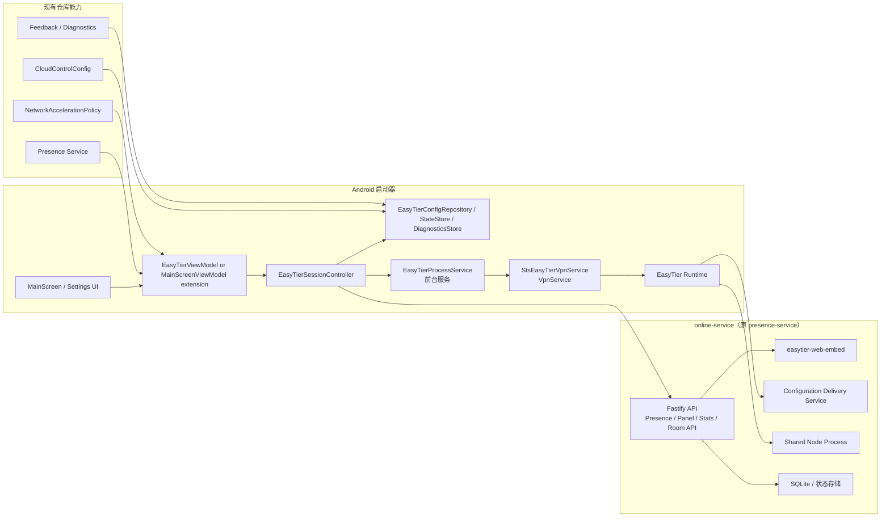
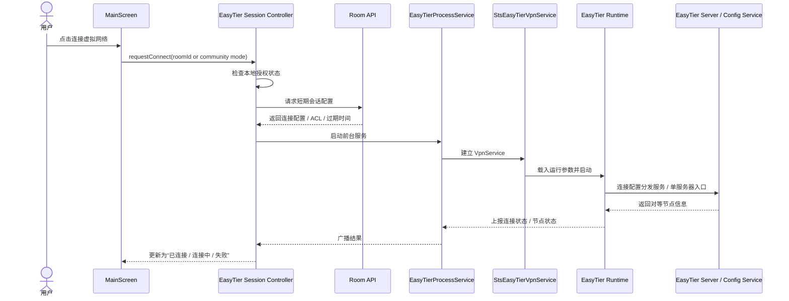

# EasyTier 虚拟组网接入方案与开发计划

本文用于落地“方案 1: 基于 EasyTier 的启动器内置虚拟组网”。

结论先行：

- 在“可以提供中心服务器、接受中继流量、希望后续可运营”的前提下，`EasyTier` 是当前更适合这个仓库的方案。
- 对这个仓库而言，重点不是单纯把一个 VPN 跑起来，而是把它接入现有的 `CloudControlConfig`、前台服务、启动器主界面状态、日志诊断与网络策略。
- 产品形态上，不建议长期维持“所有玩家永久进入同一个完全互通的大 LAN”。MVP 可以先支持一个共享网络验证链路，但正式方案应转向“房间网络 / 角色分组 / ACL 白名单”。

## 1. 方案选择依据

截至 `2026-07-09`，EasyTier 当前公开能力与本项目最相关的点有：

- 官方仓库与发布页：
  - GitHub: <https://github.com/EasyTier/Easytier>
  - Releases: <https://github.com/EasyTier/EasyTier/releases>
- 自建 Web Console / Config Delivery Service：
  - <https://easytier.cn/en/guide/network/web-console.html>
- 自建 Shared Node / Shared Node Cluster：
  - <https://easytier.cn/en/guide/network/host-public-server.html>
- ACL / Group / Zero-trust 风格访问控制：
  - <https://easytier.cn/en/guide/config/acl.html>
- WireGuard Client 接入能力：
  - <https://easytier.cn/en/guide/network/use-easytier-with-wireguard-client.html>
- 配置项总表：
  - <https://easytier.cn/en/guide/network/configurations.html>

选择 EasyTier 而不是继续优先考虑 OpenP2P / ZeroTier 的原因：

1. 它已经提供可自建的控制面和配置分发服务，适合做“你自己运营”的长期能力。
2. 它支持自建接入节点、配置分发和集中转发，与你“中心服务器可转发”的前提高度匹配。
3. 它已有 ACL、private mode、relay whitelist、Magic DNS、KCP/QUIC proxy 等可运营能力，后续做房间化、角色化更顺手。
4. 它已经明确面向“游戏联机 / EasyTier Game Launcher”场景，不只是一个通用内网穿透工具。

## 2. 本仓库的现有约束

这不是一个纯桌面启动器，而是一个 Android/Kotlin 启动器。现有架构会直接影响 EasyTier 的接法：

- Android 应用边界：
  - `app/build.gradle.kts`
  - 当前 `minSdk = 26`，`targetSdk = 33`
- Manifest 已有前台服务基础：
  - `app/src/main/AndroidManifest.xml`
- 现有云控入口：
  - `app/src/main/java/io/stamethyst/config/CloudControlConfig.kt`
- 现有在线心跳 / Presence：
  - `app/src/main/java/io/stamethyst/backend/presence/GamePresenceReporter.kt`
  - `app/src/main/java/io/stamethyst/backend/presence/GamePresenceClient.kt`
- 现有前台长任务服务模式：
  - `app/src/main/java/io/stamethyst/backend/workshop/WorkshopDownloadProcessService.kt`
  - `app/src/main/java/io/stamethyst/backend/steamcloud/SteamCloudSyncProcessService.kt`
- 现有主界面状态中心：
  - `app/src/main/java/io/stamethyst/ui/main/MainScreenViewModel.kt`
- 现有 VPN 感知网络策略：
  - `app/src/main/java/io/stamethyst/backend/network/NetworkAccelerationPolicy.kt`
  - `app/src/main/java/io/stamethyst/backend/steamcloud/SteamCloudNetworkEnvironment.kt`

这意味着 EasyTier 不是一个孤立功能，而是至少要同时处理下面几件事：

1. Android `VpnService` 授权与生命周期。
2. 前台服务通知、后台启动限制、断线重连。
3. VPN 激活后，现有 GitHub / Steam 加速链路会被 `NetworkAccelerationPolicy` 识别为“应绕过加速”。
4. UI 侧需要像 Steam Cloud / Workshop 一样，拥有可恢复的状态、结果广播和错误展示。
5. 日志 / 反馈压缩包需要能包含 EasyTier 运行诊断，否则后期很难排查 NAT、ACL、relay、权限与系统杀进程问题。

### 2.1 服务命名决策

当前仓库里已经存在 `presence-service/`，它负责：

- App Presence WebSocket 上报
- 在线分布 / 数据看板
- 面板推送与统计快照
- 相关 Docker / GHCR 发布流程

但在本方案里，它未来不应再只是一个“presence 服务”。本文后续统一把升级后的服务称为 `online-service`，目标职责为：

- 在线状态上报
- 数据看板与在线统计
- 房间 / 会话 API
- EasyTier 服务器侧整合能力

为避免一次性迁移面过大，建议把“服务命名”和“仓库目录重命名”拆成两步：

1. 先把部署产物、容器名、镜像名、面板标题统一改为 `online-service`
2. 再在独立提交中处理 `presence-service/` 目录、workflow 文件名、包名与文档引用

## 3. 产品目标与范围

本期目标：

- 在启动器内提供“连接虚拟网络 / 断开虚拟网络”能力。
- 玩家点击连接后，可以进入同一逻辑虚拟网络，并让游戏流量走这条链路。
- 连接状态、节点状态、错误摘要、重连状态在启动器内可见。
- 所有关键配置由你自建的中心服务器控制，不把长期密钥硬编码进 APK。

本期不做：

- 不把 EasyTier 当成系统级全局 VPN 产品来做。
- 不在第一阶段直接做复杂的跨房间运营后台。
- 不在第一阶段替代现有更新、Workshop、Steam Cloud 链路。
- 不默认开放“所有玩家对所有端口完全互通”。

建议的产品演进：

1. `MVP / 内测`
   - 先支持一个共享社区网络，打通 Android 侧接入、授权、状态、断线重连、诊断。
2. `正式版`
   - 切到房间级凭据、ACL 组控制、临时会话、房主权限、房间过期回收。

## 4. 推荐总体架构



### 4.1 控制面拆分

建议拆成两层，但这两层都收敛到同一个 `online-service` 容器中，而不是额外再开一套独立 Docker 服务：

1. `EasyTier 控制面`
   - 负责节点注册、配置分发、单服务器入网与转发能力。
   - 组件为 `easytier-web-embed` 与单个 EasyTier server 进程。

2. `启动器业务控制面`
   - 负责“谁能加入哪个房间”“何时发临时凭据”“玩家 UI 看见什么状态”。
   - 建议单独做 `Room API / Session API`。
   - 不建议把房间业务逻辑全部塞进 EasyTier Console 本身，而是由 `online-service` 的 Fastify 层承载。

### 4.2 单容器整合模型

这里的“合并进一个 Docker 容器”建议理解为“单容器、多进程”，而不是把所有能力硬揉成一个二进制：

- `Fastify + WebSocket + SQLite` 继续负责 Presence、面板、在线统计、Room API
- `easytier-web-embed` 作为容器内子进程提供 EasyTier 控制面
- 单个 EasyTier server 进程作为容器内子进程提供入网 / 转发能力
- 通过统一 entrypoint、supervisor 或进程守护脚本管理生命周期

这样做的好处：

1. 复用现有 `presence-service` 的 Node/Fastify 代码和发布流程。
2. 容器外部只暴露一个统一服务概念，即 `online-service`。
3. 数据看板、在线统计、房间 API 与 EasyTier 会话可共享一套状态存储和诊断出口。

需要明确的代价：

1. 单服务器部署时，面板、Room API、配置分发和 EasyTier server 都会成为同一个故障域。
2. 当前方案明确接受单点故障，以换取部署和运维复杂度更低。

### 4.3 Android 端拆分

建议在 `app/src/main/java/io/stamethyst/backend/easytier/` 下新增独立子系统：

- `EasyTierSessionController`
  - 统一处理连接、断开、重连、会话恢复。
- `EasyTierPermissionCoordinator`
  - 处理 `VpnService.prepare(...)` 的授权流程。
- `EasyTierProcessService`
  - 类似 `SteamCloudSyncProcessService`，作为前台服务承载长生命周期连接。
- `StsEasyTierVpnService`
  - 作为真正的 `VpnService` 接口层。
- `EasyTierStateStore`
  - 持久化当前会话、连接态、最近错误、最近节点列表摘要。
- `EasyTierDiagnosticsStore`
  - 落盘连接日志、配置快照、最近若干次失败原因。
- `EasyTierRoomApiClient`
  - 访问你的中心 Room API。
- `EasyTierConfigRepository`
  - 把 `CloudControlConfig`、Room API、用户本地偏好合并为最终运行配置。

UI 侧建议新增两个入口：

- 主界面入口：
  - 在 `MainScreen` 上提供连接按钮、状态 badge、错误摘要、节点数提示。
- 设置页入口：
  - 提供高级选项、诊断导出、是否自动连接、是否仅游戏流量走隧道等。

## 5. 配置模型建议

### 5.1 云控新增字段

建议扩展 `CloudControlSettings`，避免把 EasyTier 关键入口写死在构建期：

```json
{
  "easyTier": {
    "enabled": true,
    "roomApiBaseUrl": "https://online.example.com",
    "webConsoleApiBaseUrl": "https://online.example.com",
    "configServerUrl": "udp://online.example.com:22020",
    "entryNodeUrl": "tcp://online.example.com:11010",
    "connectTimeoutSeconds": 12,
    "statusPollIntervalSeconds": 5,
    "allowSharedCommunityNetwork": false,
    "defaultMode": "room"
  }
}
```

建议新增字段：

- `easyTier.enabled`
- `easyTier.roomApiBaseUrl`
- `easyTier.webConsoleApiBaseUrl`
- `easyTier.configServerUrl`
- `easyTier.entryNodeUrl`
- `easyTier.connectTimeoutSeconds`
- `easyTier.statusPollIntervalSeconds`
- `easyTier.defaultMode`
- `easyTier.allowSharedCommunityNetwork`

如果采用本文的单服务器方案：

- `roomApiBaseUrl` 与 `webConsoleApiBaseUrl` 通常会落在同一个 `online-service` 域名上，只是路由前缀不同。
- `entryNodeUrl` 是启动器实际使用的连接入口地址，应作为云控下发的唯一真值，不要在 APK、本地偏好或代码常量里再维护第二份。
- `EasyTierConfigRepository` 应优先读取 `CloudControlConfig.current().easyTier.entryNodeUrl`，再组合本地运行参数。

### 5.2 Room API 建议

建议不要把长期 `network_secret` 暴露给 APK，而是由房间服务签发短期会话：

- `POST /api/lan/session/start`
  - 输入：房间 ID、玩家身份、客户端版本、设备摘要
  - 输出：短期连接配置、会话 ID、过期时间、ACL 组信息
- `POST /api/lan/session/stop`
  - 输入：会话 ID
- `GET /api/lan/session/status`
  - 输入：会话 ID
  - 输出：连接状态、房间状态、服务器侧观察到的节点状态
- `GET /api/lan/rooms/{roomId}`
  - 输出：房间成员、房主、模式、是否允许新加入

MVP 可以简化成一个固定社区网络，但正式版建议尽快切到会话化接口。

## 6. 安全与网络策略建议

### 6.1 不建议永久使用“全互通共享大网”

虽然用户感知上最简单，但长期风险很高：

- 节点之间可随意扫描端口。
- 房间之间会串流量。
- 后续很难处理恶意连接、脚本探测、外挂辅助工具。
- 一旦密钥泄露，所有在线用户都会受影响。

推荐策略：

1. `MVP`
   - 共享网络，仅用于小范围测试。
   - 同时预埋房间 ID、会话 ID、ACL 组字段。
2. `正式版`
   - 每个房间使用单独凭据或独立 ACL 组。
   - 默认 deny，按端口 / 角色放行。

### 6.2 ACL 建议

利用 EasyTier 的 `group + secret + chain + rule` 机制：

- `host`
- `player`
- `observer`
- `admin`

首版建议只开放游戏真正需要的端口，其他端口默认拒绝。

如果游戏后续依赖广播发现，再单独评估是否需要放开局域网广播相关能力；不要在第一版直接为“可能会用到”而放宽 ACL。

### 6.3 与现有网络策略的冲突处理

当前仓库已有“VPN 激活时绕过加速链路”的逻辑：

- `NetworkAccelerationPolicy.shouldBypassAcceleratedLinks(...)`
- `SteamCloudNetworkEnvironment`
- `UpdateMirrorManager`

因此必须在设计上明确：

1. EasyTier 连接后，GitHub / Steam 加速链路是否自动切回官方源。
2. 是否只让游戏流量走 VPN，而把更新 / Workshop / Steam Cloud 保持在直连链路上。
3. 连接中的 Workshop 下载、Steam Cloud 同步是否需要提示用户“当前虚拟网络模式下可能自动切换网络策略”。

推荐做法：

- 第一阶段只保证“游戏联机流量”目标成立。
- 更新 / Workshop / Steam Cloud 在 EasyTier 连接期间不做额外耦合优化。
- 在 UI 上明确提示：连接虚拟网络后，部分网络加速策略会被自动绕过。

## 7. 启动器交互流程



失败路径需要覆盖：

- 用户拒绝 VPN 授权
- Room API 鉴权失败
- 配置分发服务不可达
- 云控下发的连接地址无效
- 单服务器可达但无法建立会话
- 已有其他 VPN 占用
- Android 后台限制导致服务启动失败

## 8. 代码落点建议

### 8.1 新增包结构

建议新增：

```text
app/src/main/java/io/stamethyst/backend/easytier/
  EasyTierSessionController.kt
  EasyTierProcessService.kt
  StsEasyTierVpnService.kt
  EasyTierPermissionCoordinator.kt
  EasyTierRoomApiClient.kt
  EasyTierConfigRepository.kt
  EasyTierStateStore.kt
  EasyTierDiagnosticsStore.kt
  EasyTierModels.kt
  EasyTierErrorClassifier.kt
```

UI 侧建议新增或扩展：

```text
app/src/main/java/io/stamethyst/ui/main/
  MainScreen.kt
  MainScreenViewModel.kt

app/src/main/java/io/stamethyst/ui/settings/
  ... 新增 EasyTier 设置分区
```

### 8.2 Manifest 修改点

后续实现时需要补齐：

- `VpnService` 声明
- `BIND_VPN_SERVICE` 保护
- 前台服务类型与 Android 版本适配
- 通知渠道

具体字段以实现当下的 Android 官方要求为准，不要在文档阶段把 Manifest 写死。

## 9. 分阶段开发计划

### Phase 0: 技术 Spike

目标：

- 验证 EasyTier 在当前 Android 启动器中的最小接入路径。

工作项：

- 在 `agent-tmp/` 下建立独立 spike 记录与实验脚本。
- 证明以下问题：
  - 能成功触发 `VpnService.prepare(...)`
  - 能从启动器内启动 EasyTier 运行时
  - 能根据云控下发地址连上单服务器入口
  - 能看到最小节点列表或连通性结果
  - 能断开、重连、恢复

产出：

- 一份 spike 记录
- 最小运行截图 / 日志
- 是否采用“内嵌运行时”还是“sidecar 进程”的明确结论

验收：

- 两台 Android 设备可在同一 EasyTier 网络内互相 `ping` 或完成一项最小 TCP/UDP 连通测试。

### Phase 1: 服务器基础设施

目标：

- 将现有 `presence-service` 升级并改名为 `online-service`，在同一个 Docker 容器中同时承载在线统计看板、Room API 与 EasyTier 服务器侧能力。

工作项：

- 设计并落地新的服务名：
  - 运行时服务名：`online-service`
  - 推荐镜像名：`ghcr.io/modinmobilests/slaytheamethyst-online-service`
- 在现有 Node/Fastify 服务容器中合并 EasyTier 服务器侧组件：
  - `Fastify API + Presence + Panel + Stats + Room API`
  - `easytier-web-embed`
  - 单个 EasyTier server 进程
- 增加统一 entrypoint / supervisor，管理多进程启动、退出和重启策略
- 开通配置分发端口、单服务器入口端口与 HTTPS 入口
- 统一日志、健康检查、监控和崩溃恢复
- 明确域名、TLS、端口暴露与防火墙规则
- 将“客户端连接地址从云控获取”纳入服务器阶段：
  - `online-service` 对外提供固定域名和端口
  - `docs/cloud-control/cloud-control.json` 与远端云控文件都写入 `easyTier.entryNodeUrl`
  - 启动器只通过 `CloudControlConfig` 读取连接地址
- 准备命名迁移清单：
  - `presence-service/package.json`
  - `presence-service/src/server/app.js`
  - `.github/workflows/publish-presence-service.yml`
  - GHCR `slaytheamethyst-presence-service`

推荐部署方式：

1. `单服务器`
   - `online.example.com:443`
   - `online.example.com:22020/udp`
   - `online.example.com:11010`

当前方案明确只在这一台服务器上部署 `online-service`。

安全注意：

- EasyTier 官方文档当前提到 Web Console 默认存在 `admin` 和 `user` 两个账户，部署后必须第一时间改密、限制来源或直接前置你自己的鉴权与反向代理，不要裸暴露到公网。
- 不要让 `online-service` 的 Room API 直接透传所有 EasyTier 管理操作；应只暴露启动器实际需要的受限接口。
- 云控下发的 `entryNodeUrl` 必须与服务器实际开放地址保持同步；一旦更换域名或端口，应先更新云控，再发版或通知灰度。

验收：

- Android 端可连接 `online-service` 提供的配置分发与房间接口。
- `online-service` 同时可提供在线看板、在线统计与 EasyTier 会话能力。
- 启动器可通过云控读取 `easyTier.entryNodeUrl` 并成功入网。
- 单服务器模式下，连接、看板和会话签发链路全部打通。

### Phase 2: 启动器后端骨架

目标：

- 在 APK 内建立完整的连接生命周期与状态回传链路。

工作项：

- 新增 `EasyTierProcessService`
- 新增 `StsEasyTierVpnService`
- 新增 `EasyTierStateStore`
- 新增 `EasyTierDiagnosticsStore`
- 在 `MainScreenViewModel` 中挂载连接态
- 建立广播 / `ResultReceiver` / 持久化三者之间的状态契约

建议直接参考现有服务模式：

- `WorkshopDownloadProcessService`
- `SteamCloudSyncProcessService`

验收：

- 前台服务通知可正确显示“连接中 / 已连接 / 重连中 / 失败”。
- 杀后台、切前台、切页面后状态不丢。

### Phase 3: 主界面与设置页接入

目标：

- 让普通玩家可以在主界面完成连接与断开。

工作项：

- 主界面增加虚拟网络卡片 / 按钮 / 状态 chip
- 展示节点数、最近错误摘要、当前模式
- 设置页增加高级选项：
  - 是否允许共享社区网络
- 完成 VPN 权限引导和拒绝后的回退文案

验收：

- 用户不看文档也能完成首次连接。
- 错误提示能区分“权限问题 / 服务器不可达 / 网络冲突 / 已有其他 VPN”。

### Phase 4: Room API 与 ACL

目标：

- 从“固定共享网络”进化到“房间化 / 会话化 / 白名单化”。

工作项：

- 允许玩家创建房间，一个房间代表一个虚拟网络
- 上线 `Room API`
- 可以查看有哪些在线房间
- 实现短期会话配置签发
- 为房主 / 房间生命周期 / 超时回收建立业务规则

验收：

- 房间关闭后，旧会话不能继续加入。
- 非法客户端拿不到长期共享密钥。
- 不同房间之间默认不互通。

### Phase 5: 诊断、回归

目标：

- 把它变成一个可维护功能，而不是一次性 Demo。

工作项：

- 把 EasyTier 日志纳入反馈压缩包
- 增加连接错误分类与 FAQ 文案
- 补单元测试：
  - 云控解析
  - 状态机
  - 错误分类
  - Room API 响应解析

验收：

- 反馈包里能看出：
  - 当前云控入口
  - 云控下发的连接地址
  - 最近连接状态
  - 最近错误摘要

## 11. 主要风险与应对

### 11.1 Android 单 VPN 冲突

风险：

- 用户手机可能已经在使用 Clash、Tailscale、公司 VPN 或系统级代理。

应对：

- UI 明确提示“连接虚拟网络会占用系统 VPN”。
- 在连接前检测并给出可恢复文案。

### 11.2 VPN 激活后影响现有加速策略

风险：

- 当前仓库在 VPN 场景下会绕过一部分加速链路。

应对：

- 更改加速链路逻辑，连接后，不再绕过加速链路

### 11.3 EasyTier Android 接法不稳定

风险：

- 上游 Android 接入方式未必像桌面那样成熟。

应对：

- 把 Phase 0 作为硬门槛。
- 在结论不清前，不要提前铺太多 UI 与服务代码。


## 12. 推荐实施顺序

如果按“最稳妥、最少返工”的顺序做，建议：

1. 先做 Phase 0，确认 Android 接法。
2. 再做 Phase 1，先把统一的 `online-service` 单服务器容器和云控地址下发链路跑稳。
3. 接着做 Phase 2，把服务与状态链路搭出来。
4. 然后做 Phase 3，让用户能用。
5. 最后做 Phase 4，把共享网络收敛到房间化和 ACL。

## 13. 本文对应的仓库改造原则

后续实现时应遵守：

1. 不要把 EasyTier 逻辑散落到 `MainScreenViewModel`、设置页和若干工具类里，应像 `Workshop` / `SteamCloud` 一样形成独立后端子系统。
2. 不要把房间业务逻辑塞进 EasyTier Console，应保持“EasyTier 基础设施”和“启动器业务控制面”分层。
3. 不要在第一版直接默认开放所有端口。
4. 不要把长期共享密钥写死在 APK、本地偏好或公开仓库配置里。
5. 任何临时反编译、抓包、实验性文件都放在 `agent-tmp/`，不进入正式提交。
