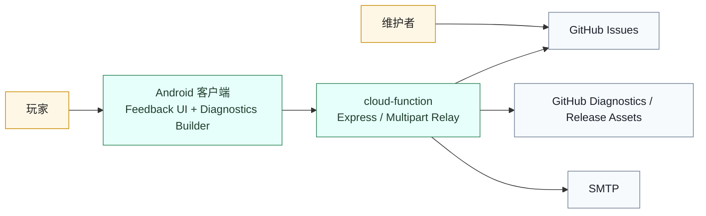
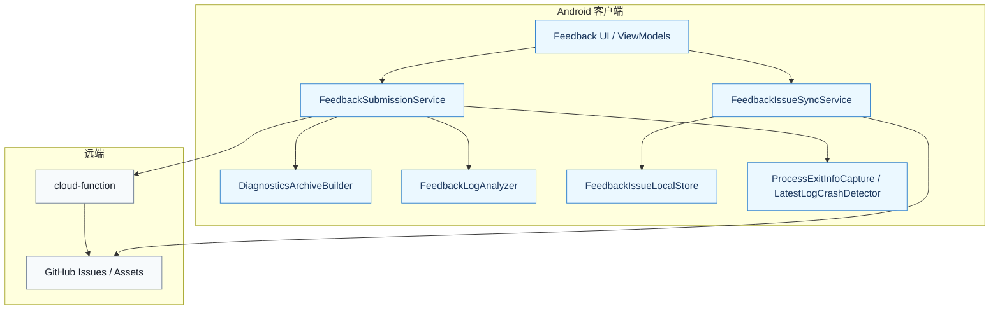
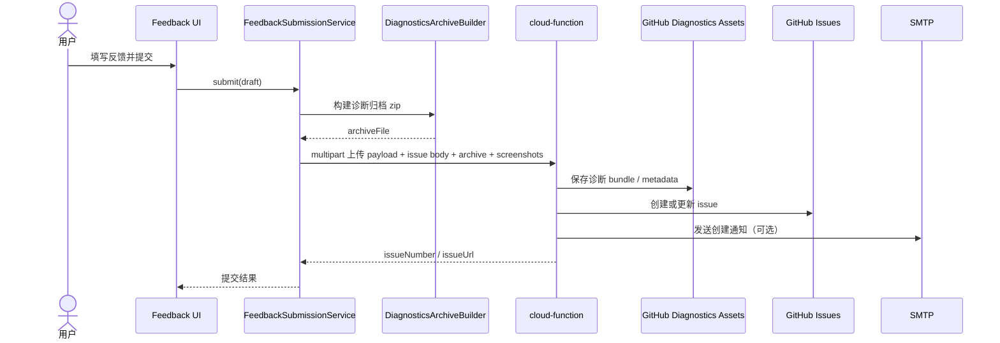
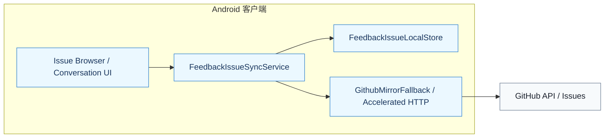
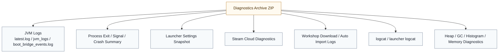

# 反馈、诊断与 GitHub 链路专题

用于回答两个问题：

- 为什么反馈系统不是“客户端直接发一个 issue”？
- 诊断、Issue、邮件通知与客户端订阅是如何形成闭环的？

## 1. 子系统目标

该子系统负责：

- 客户端收集环境信息、启用模组快照、日志摘要与截图
- 构建标准化诊断归档
- 上传反馈包到中继服务
- 在 GitHub 上创建与同步 issue
- 保存诊断资产
- 客户端本地缓存与订阅 issue 状态

## 2. 子系统上下文图

## 3. 客户端内部组件图

## 4. 反馈提交时序图

## 5. 问题同步与本地订阅图

### 设计含义

- 客户端不是“只发一次请求就结束”，而是长期维护本地 issue 订阅与缓存。
- `FeedbackIssueSyncService` 负责浏览、订阅、刷新、未读状态与本地缓存合并。
- GitHub 访问还经过镜像/加速与回退策略，而不是纯裸连。

## 6. 诊断归档内容图

## 7. 为什么采用“客户端 + 中继 + GitHub 资产”架构

1. 诊断包体积和结构明显超出“直接 issue 文本提交”的适用范围。
2. 诊断资产写入 Release assets，不污染主仓库 Git 历史。
3. 邮件通知、私有联系信息处理与 webhook 回调更适合在中继端完成。
4. 客户端本地仍然保留 issue 浏览、订阅和同步能力，形成闭环。

## 8. 关键架构结论

1. 客户端负责“采集、归档、上传前组装”。
2. 中继负责“鉴权、资产落盘、issue 创建、邮件通知、webhook 事件处理”。
3. GitHub 同时承担“工单系统”和“诊断资产索引”两个角色，但数据面被拆分到 Issues 与 Release Assets。
4. 该设计把终端环境证据与维护者处理链路真正连接起来，而不是只做一个表单提交。
