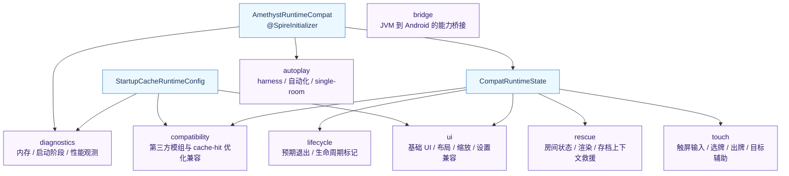
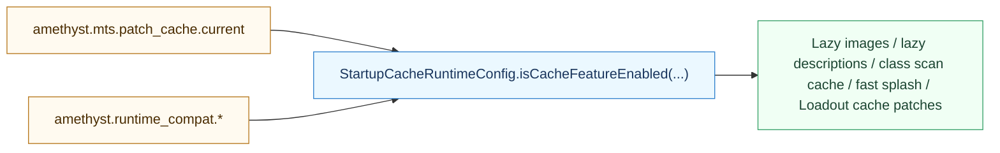
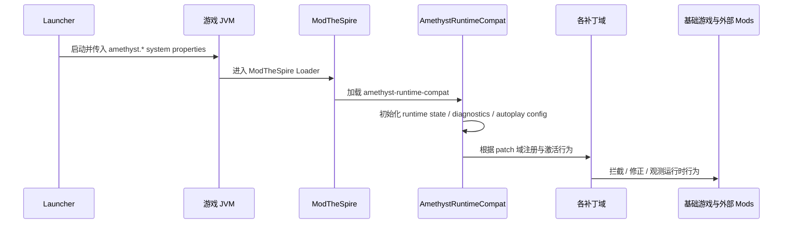

# Runtime Compat 补丁域专题

用于回答两个问题：

- 为什么大量兼容修复以 ModTheSpire Patch 形式交付？
- runtime-compat 内部如何保持“按修复域组织”而不是变成一个巨大补丁堆？

## 1. 设计目标

`amethyst-runtime-compat` 的目标是把更适合在游戏运行期注入的修复，以独立运行时 Mod 的形式交付，而不是把所有问题都做成主 Jar 静态改写。

适合放在这里的问题类型包括：

- 运行时行为兼容
- 触屏 / 输入适配
- 特定第三方 Mod 兼容
- 诊断钩子
- 救援型兜底补丁
- harness-only 自动化驱动

## 2. 补丁域结构图

## 3. 运行时装配位置图

### 设计含义

- 启动器通过 `StsLaunchSpec` 与配置项把控制参数写入 JVM system properties。
- runtime-compat 并不单独定义自己的启动器，而是作为 MTS 运行时 Mod 加载。
- 每个 patch 域在运行期按条件激活，而不是在 APK 构建时固化所有行为。

## 4. 补丁域与问题类型映射

| 补丁域 | 主要问题类型 |
| --- | --- |
| `ui` | 字体、UI 缩放、分辨率下拉、主菜单布局、显示设置提示 |
| `touch` | 触屏选择、拖拽、确认按钮残留状态、目标辅助、tap-inspect / tap-play |
| `rescue` | map node / room context 缺失、事件房间异常、手牌布局上下文缺失等兜底 |
| `compatibility` | 第三方 mod 兼容、cache-hit-only 性能优化、类扫描缓存 |
| `diagnostics` | 启动阶段 profiling、内存诊断、GPU 资源诊断、调试触发器 |
| `lifecycle` | 预期退出标记、减少误判崩溃恢复页 |
| `bridge` | 例如 Android 文件选择器桥等 JVM 到 Android 能力桥接 |
| `autoplay` | smoke / autoplay / single-room 等自动化运行模式 |

## 5. cache-hit-only 特性控制图

### 设计含义

- 某些优化只在 `patch_cache.current=true` 时启用。
- 这样可以区分“首次启动 / cache-miss”与“cache-hit”路径。
- 架构上避免把 cache-hit 性能优化错误地施加到所有运行场景。

## 6. 运行时行为时序图

## 7. 为什么采用“运行时 Mod”而不是全部做成主 Jar 改写

1. 许多问题天然是运行时行为问题，适合通过 patch 拦截原始调用点。
2. Patch 可以按问题域拆分，更容易审查、回退和文档化。
3. 第三方 Mod 兼容问题常常依赖运行时上下文，不适合提前静态固化。
4. harness-only 自动化和诊断钩子不应污染普通运行路径的主 Jar。

## 8. 为什么必须按域拆补丁

如果不按域拆分，runtime-compat 很容易退化成一个巨大、不可审查、不可回退的 patch 池。

当前按域拆分带来的收益：

- 审查时能按问题域理解补丁目的
- 回退时能按问题域禁用或删除
- README 能逐项映射“症状 -> patch class -> fix 类型”
- 可以把 cache-hit-only、touch-only、diagnostics-only 行为隔离出来

## 9. 关键架构结论

1. `amethyst-runtime-compat` 是“运行时兼容层”，不是普通功能型 Mod。
2. 它通过 MTS patch 机制把启动器控制参数转成运行时行为控制。
3. 其专业价值不在于 patch 数量，而在于“按域组织、按条件激活、按症状落地”。
