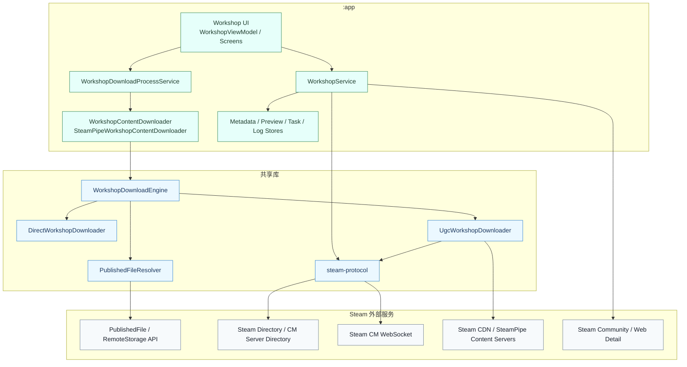
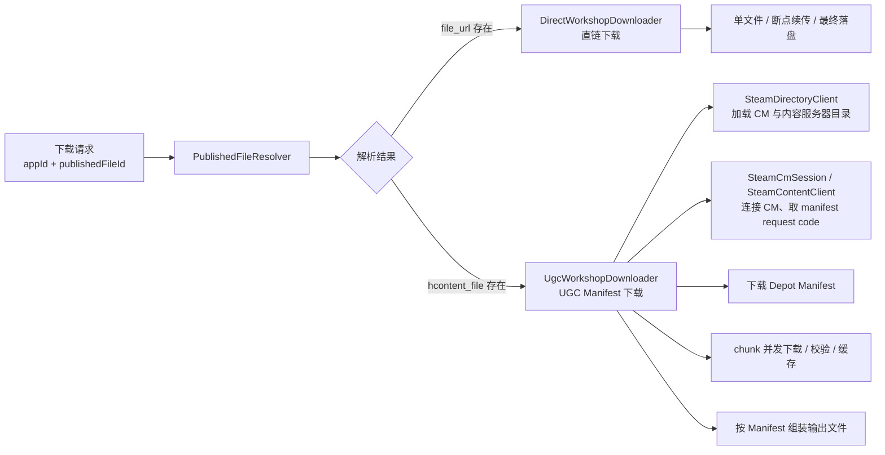
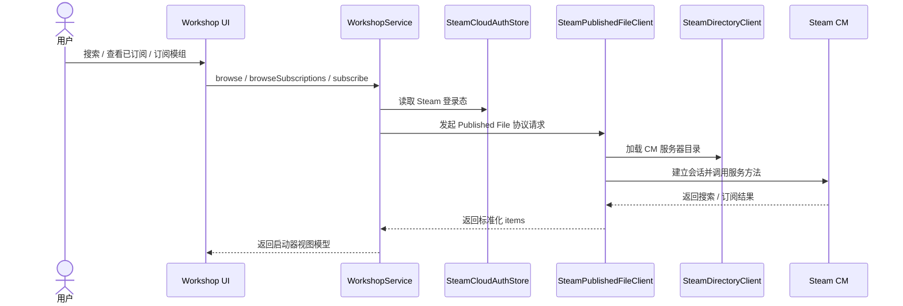
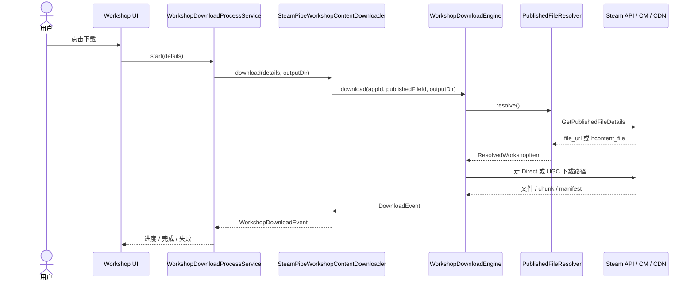

# Workshop 与 Steam 协议栈专题

用于回答两个问题：

- Workshop 功能为什么不是一个普通 HTTP 下载器？
- App、共享库、Steam 协议与内容下载之间的边界如何划分？

## 1. 子系统目标

该子系统负责：

- 浏览 Workshop 内容
- 查询已订阅项
- 订阅 / 退订
- 下载 Workshop 内容
- 管理下载进度、后台服务、日志与落盘结果

## 2. 容器内部分层图

## 3. 关键职责分工

| 层次 | 主要职责 |
| --- | --- |
| `WorkshopViewModel / UI` | 用户交互、页面状态与下载命令发起 |
| `WorkshopService` | 浏览、订阅、详情补全、Steam 登录态读取、App 侧编排 |
| `WorkshopDownloadProcessService` | 后台下载生命周期、通知、并发槽位与任务队列管理 |
| `WorkshopContentDownloader` | 适配 `WorkshopDownloadEngine` 输出为启动器内部事件模型 |
| `WorkshopDownloadEngine` | 统一下载编排入口，决定走直链还是 UGC Manifest |
| `PublishedFileResolver` | 调用 Steam Published File 详情接口并解析下载模式 |
| `DirectWorkshopDownloader` | 处理 `file_url` 直链下载、断点续传与落盘 |
| `UgcWorkshopDownloader` | 处理 SteamPipe / UGC Manifest / chunk / CDN 下载与组装 |
| `steam-protocol` | CM 会话、目录服务、内容服务、Published File 协议调用 |

## 4. 下载路径分叉图

### 设计含义

- Workshop 内容并不总是一个公开文件 URL。
- 当存在 `hcontent_file` 时，需要走 Steam 的更底层内容分发路径。
- 因此该子系统天然包含协议解析、目录发现、内容服务器选择、manifest 解析与 chunk 组装。

## 5. 浏览与订阅链路图

## 6. 后台下载时序图

## 7. 关键架构结论

1. `WorkshopService` 主要负责 App 侧业务编排，不承担底层下载实现。
2. `workshop-core` 负责下载编排与文件落地，是独立的下载核心库。
3. `steam-protocol` 负责更底层的 Steam 协议通信，不与 UI 耦合。
4. 下载路径必须支持“直链模式”和“SteamPipe/UGC 模式”两条链。
5. `WorkshopDownloadProcessService` 使下载生命周期独立于前台页面，适合长任务与断续恢复。
