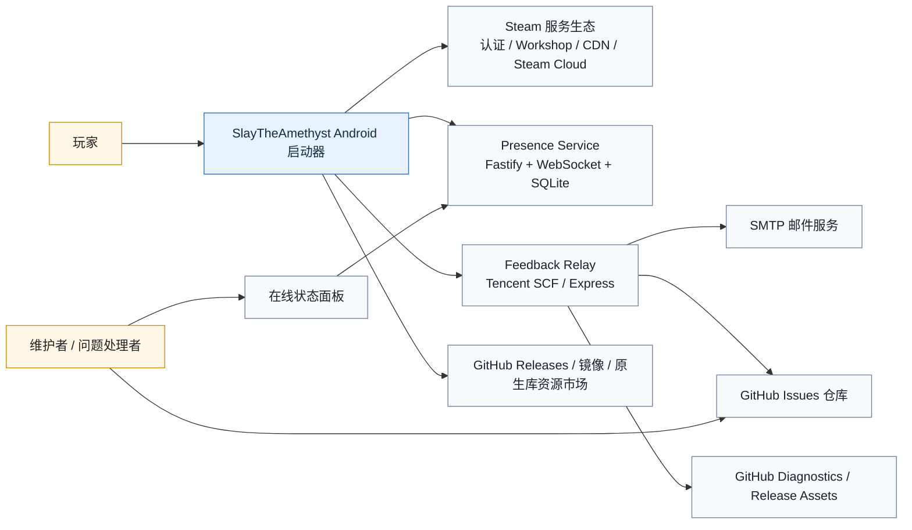
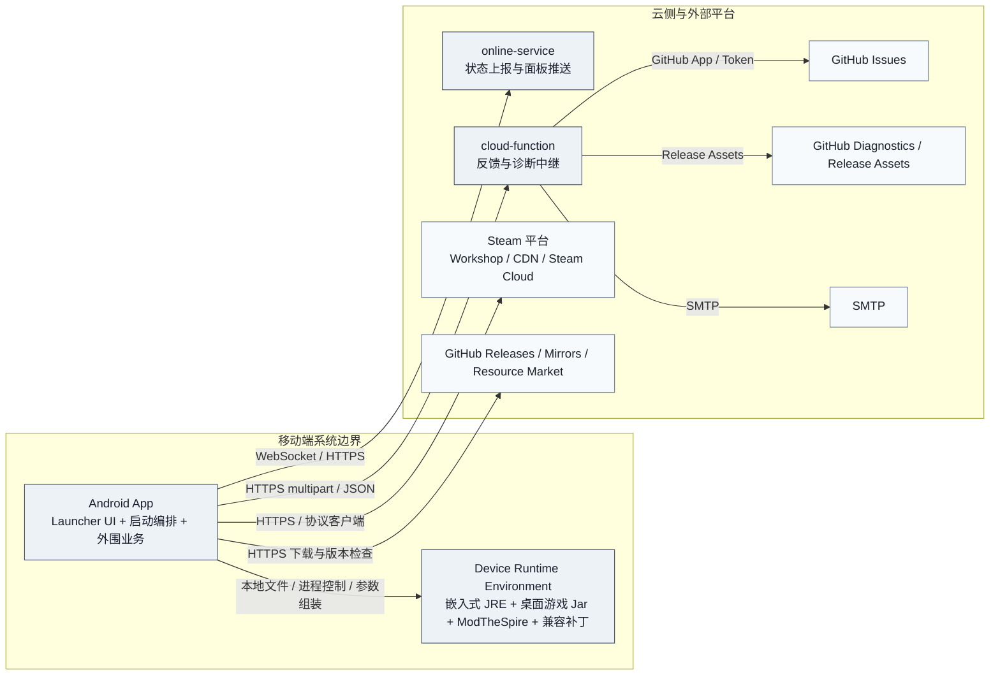
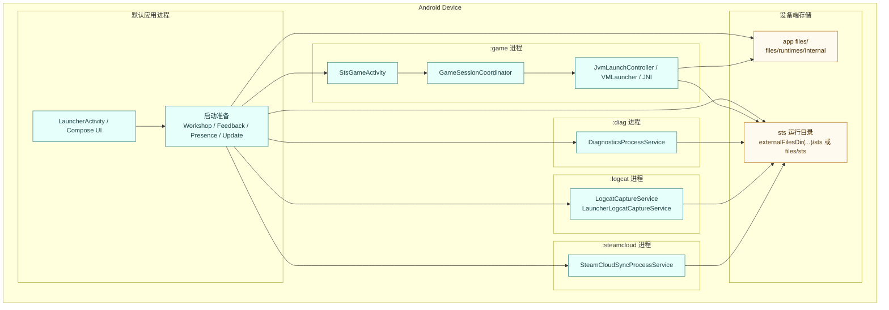
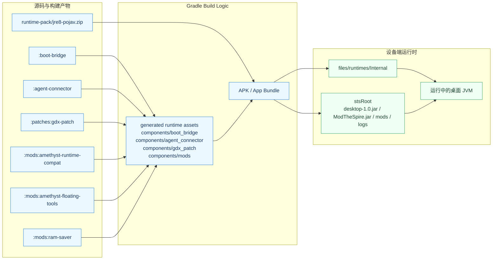
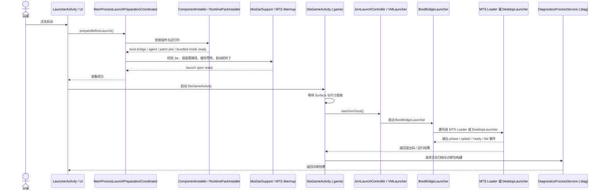
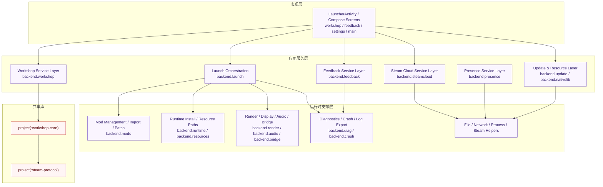

# SlayTheAmethyst 系统架构设计图集

面向对象：技术评审、架构汇报、实现对齐。

本文档不是“仓库目录图”，而是按系统分析与设计中的常见正式视图来组织：

- 系统上下文图
- 容器图
- 部署与进程图
- 运行时装配图
- 关键启动时序图
- 应用内部组件图

当前图集以 `C4` 的组织方式为主，并补充本项目必须单独表达的 Android 多进程、JVM 运行时装配与启动时序视图。

## 1. 架构范围与边界

系统范围定义如下：

- 主系统：`SlayTheAmethyst` Android 启动器
- 目标运行对象：模组版 `Slay the Spire`
- 运行方式：Android 应用负责准备运行时、修补桌面 Jar、组装类路径，并在嵌入式 Java 运行时中启动桌面版游戏与模组
- 系统外部依赖：Steam 生态、反馈中继服务、Presence 服务、GitHub 资产与更新分发、邮件通知与镜像资源

## 2. 架构驱动因素

本系统的核心架构驱动因素不是普通移动 App 的页面组织，而是以下几项：

1. Android 上托管桌面 Java 游戏与桌面模组运行时。
2. 在不破坏桌面模组生态的前提下做兼容修补、输入适配和性能缓解。
3. 将大量桌面侧运行时组件作为 APK 内资产交付，并在设备端动态安装和组装。
4. 将游戏进程、诊断、日志抓取、Steam Cloud 同步等职责分离到不同 Android 进程。
5. 将 Workshop、反馈、Presence、更新、Steam Cloud 等外围能力集成进同一启动器。

## 3. 视图一：系统上下文图

这张图回答“系统和谁交互、边界在哪里”。

### 上下文说明

- 玩家通过 Android 启动器完成启动、模组管理、Workshop 浏览下载、Steam Cloud 登录与同步、反馈提交。
- 启动器直接与 Steam 相关服务交互，用于 Workshop 内容访问与 Steam Cloud 相关能力。
- Presence 已迁移到独立的 `online-service`，通过 WebSocket 上报状态并提供面板。
- 反馈链路使用独立的 `cloud-function` 中继，再写入 GitHub Issues 和诊断资产仓库。
- 更新与外部资源获取依赖 GitHub Releases、镜像与原生库资源市场。

## 4. 视图二：系统容器图

这张图回答“系统由哪些主要可部署/可演化单元组成，它们如何协作”。

### 容器职责说明

| 容器 | 职责 |
| --- | --- |
| `Android App` | 提供 UI、配置、启动准备、模组导入、Workshop、反馈、Presence、更新、Steam Cloud 等能力 |
| `Device Runtime Environment` | 在设备端承载嵌入式 Java 运行时、Boot Bridge、ModTheSpire、patched `desktop-1.0.jar`、兼容补丁与附加 Mod |
| `online-service` | 接收在线状态 WebSocket，上报与推送面板统计 |
| `cloud-function` | 反馈包上传、Issue 创建/同步、诊断资产持久化、邮件通知 |

## 5. 视图三：Android 部署与进程图

这张图回答“移动端落地后，职责如何在 Android 进程与本地存储上展开”。

### 进程设计说明

- 默认进程承担 UI、启动准备与大部分外围业务。
- `:game` 进程专门承载渲染 Surface、JVM 启动与游戏运行。
- `:diag` 进程隔离日志归档与诊断打包，降低对主 UI 与游戏进程的干扰。
- `:logcat` 进程隔离日志抓取。
- `:steamcloud` 进程隔离较重的同步流程。

这种拆分体现的是“运行时托管系统”而不是普通单进程移动 App。

## 6. 视图四：运行时装配图

这张图回答“桌面运行时是如何从仓库模块装配到 APK，再装到设备端运行目录中的”。

### 装配设计说明

- `:app` 不是直接“链接”这些桌面组件，而是在构建期把它们打包进运行时资产。
- 设备端启动前由安装/准备逻辑将运行时包、JAR、补丁和 Mod 落到本地运行目录。
- 启动时真正运行的是设备上的桌面 JVM 进程，而不是 Android ART 内的一组普通业务对象。

这部分是本系统和普通 Android App 最大的结构性差异。

## 7. 视图五：关键启动时序图

这张图回答“从玩家点击启动到游戏进入桌面 JVM 的关键时序是什么”。

### 时序设计说明

- 启动准备在默认进程先完成，成功后才进入 `:game`。
- `BootBridgeLauncher` 是 JVM 入口桥，真正业务入口再委托给 `MTS Loader` 或原版 `DesktopLauncher`。
- 启动事件既是进度渠道，也是故障诊断渠道。

## 8. 视图六：`:app` 内部组件图

这张图回答“Android 主应用内部的主要职责如何分层”。

### 分层设计说明

- 表现层负责交互，不直接承载桌面运行时控制细节。
- `backend.launch` 是启动编排核心，协调安装、校验、补丁、类路径与真正启动。
- `backend.mods` 是本项目最关键的特有子系统之一，承担 Mod 校验、导入、兼容补丁与类路径装配。
- `workshop-core` 与 `steam-protocol` 从主 App 中抽出，形成更清晰的协议/下载栈边界。

## 9. 汇报建议

如果要给技术人员做正式汇报，不建议只展示一张总图。推荐用下面的顺序：

1. 先讲“系统上下文图”，说明系统边界和外部依赖。
2. 再讲“容器图”，说明移动端、设备运行时、云侧服务的职责拆分。
3. 再讲“Android 部署与进程图”，突出本项目的多进程设计。
4. 再讲“运行时装配图”，突出本项目不是普通 App，而是桌面 JVM 托管系统。
5. 最后讲“关键启动时序图”和“内部组件图”，解释启动路径与实现组织。

## 10. 本文档的实现依据

以下实现证据已在当前仓库中核对：

- `settings.gradle.kts`
- `app/src/main/AndroidManifest.xml`
- `app/build.gradle.kts`
- `gradle/build-logic/src/main/kotlin/StsAndroidAppBuildPlugin.kt`
- `docs/backend-startup-chain.md`
- `online-service/README.md`
- `cloud-function/README.md`
- `cloudflare-presence-worker/README.md`
- `agent-connector/README.md`
- `mods/amethyst-runtime-compat/README.md`

## 11. 下一层深化建议

如果后续要继续升到“更细设计评审”级别，建议再补以下专题：

1. `Steam Cloud` 专题图，专门讲登录、鉴权、manifest、diff、pull/push 与本地快照。
2. `Launch / Mod Assembly` 专题图，专门讲 `backend.launch` 与 `backend.mods` 的装配边界。
3. `Observability` 专题图，专门讲 `boot_bridge_events.log`、`latest.log`、`logcat`、crash bundle 与性能审计日志之间的关系。

这三张会比继续扩大总图更有价值，也更适合深入技术评审。

## 12. 附录专题图与汇报顺序

为了把主报告整理成可直接讲述的材料，附加了以下文档：

- [架构汇报顺序建议](./architecture/presentation-flow.md)
- [Workshop 与 Steam 协议栈专题](./architecture/workshop-steam-architecture.md)
- [反馈、诊断与 GitHub 链路专题](./architecture/feedback-diagnostics-architecture.md)
- [Runtime Compat 补丁域专题](./architecture/runtime-compat-architecture.md)
